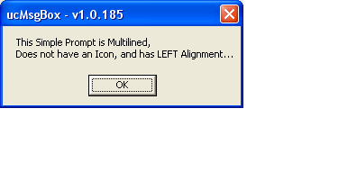



## ucMsgBox \- System MsgBox SubClasser

### Description

ucMsgBox is a single-file UserControl which uses Paul Caton&#8217;s self-subclassing thunk to provide the ultimate control over the System MsgBox. This control allows the developer to Change/Set the Startup Alignment (CenterScreen, CenterOwner), Prompt Alignment (Left, Center, Right), Fonts, Icons (Native + Custom), BackColor, and ForeColor. In addition, the Theme state of the MsgBox dialog is customizable and supports Auto, Win9x, and WinXP button Themes. Moreover, ucMsgBox provides the mechanism to turn any MsgBox into a SelfClosing dialog with countdown enumeration. To provide accuracy of the countdown, one can set the ThreadPriority to allow for high resolution timing. In short, this UserControl takes the standard MsgBox to a new level with out changing one line of code for standard MsgBox calls!!! 

----

(Update 16Mar07 &#8211; v1.0.240) Fixed minor bug in the SetProcessPriority Method, Added support for all default WinXP Luna Styles (Blue (Blue), Olive Green (HomeStead), Silver (Metallic). Enhance Win9x drawing style to support custom captions, Added Caption Property to provide custom button captions, Added CaptionType Property to allow rapid switching between default and custom captions, Added Subclass_StopAll to the zIdx Method to prevent loss of Mouse and Keyboard inputs when the hWnd is null (see zIdx Method Notes).

Enjoy, TerriTop
 
### More Info
 

             |
---                |---
**Submitted On**   |2007-03-16 13:16:16
**By**             |[TerriTop](https://github.com/Planet-Source-Code/PSCIndex/blob/master/ByAuthor/territop.md)
**Level**          |Advanced
**User Rating**    |5.0 (85 globes from 17 users)
**Compatibility**  |VB 6\.0
**Category**       |[Custom Controls/ Forms/  Menus](https://github.com/Planet-Source-Code/PSCIndex/blob/master/ByCategory/custom-controls-forms-menus__1-4.md)
**World**          |[Visual Basic](https://github.com/Planet-Source-Code/PSCIndex/blob/master/ByWorld/visual-basic.md)
**Archive File**   |[ucMsgBox\_\-2054113162007\.zip](https://github.com/Planet-Source-Code/territop-ucmsgbox-system-msgbox-subclasser__1-67387/archive/master.zip)

